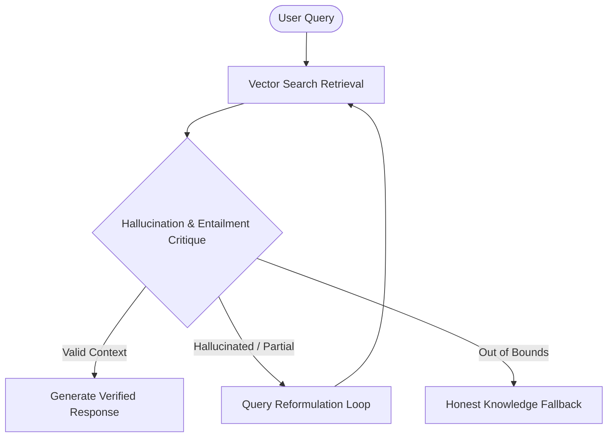

# Hi there, I'm Gandham Venkata Manu Rohith 👋

<p align="center">
  <a href="https://linkedin.com/in/manugandham27"></a>
  <a href="mailto:gvmanurohithgvmr2006@gmail.com"></a>
  <a href="https://github.com/manugandham27"></a>
</p>

###  AI/ML & Systems Engineer | Specializing in LLMs, RAG Pipelines & Model Optimization

I design and deploy production-grade **Retrieval-Augmented Generation (RAG) engines**, **Autonomous Multi-Agent Systems**, and **Small Language Model (SLM) quantization & pruning pipelines** optimized for low-latency, resource-constrained inference.

---

## 🛠️ Tech Stack & Core Competencies

<p align="center">
  
  
  
  
  
  
  
  
</p>

```text
  🤖 AI & GenAI Systems:   LangChain | LlamaIndex | AutoGen | QLoRA / PEFT | PyTorch | Hugging Face
  ⚡ Backend & APIs:      FastAPI | Streamlit | Next.js | TypeScript | Python | Pytest
  📦 Vector DBs & Storage: Vector DBs (Chroma / Qdrant / Pinecone) | MongoDB | PostgreSQL
  🔧 DevOps & Tools:      Git | Docker | Pytest | Linux / Bash | Jupyter
```

---

## 🌟 Featured Engineering Projects

### 🛡️ [Self-Healing RAG Pipeline](https://github.com/manugandham27/The-Self-Healing-RAG-Pipeline)
> **Production-grade RAG engine with automated hallucination critique and query reformulation.**
- **Key Features**: Entailment verification, query re-writing loops, and honest fallback mechanisms when knowledge bounds are exceeded.
- **Tech Stack**: Python 3.11, LangChain, FastAPI, Vector DB, Pytest



### ⚡ [EdgeTune: SLM Quantization & Pruning Framework](https://github.com/manugandham27/Quantization-and-pruning-for-small-language-model)
> **Fine-tuning, magnitude pruning, and 4-bit uniform quantization framework for deployable SLMs.**
- **Key Features**: Evaluates Pareto tradeoff curves across memory footprint, latency (TTFT), disk storage, and ROUGE-L accuracy.
- **Tech Stack**: PyTorch, QLoRA, Hugging Face, FastAPI, Streamlit

### 🤖 [Eco-Loop Building Agents](https://github.com/manugandham27/Eco-Loop-Building-Agents)
> **Autonomous multi-agent task execution and closed-loop optimization engine.**
- **Key Features**: Coordinates multi-agent collaboration for automated problem-solving and task delegation.
- **Tech Stack**: Python, AutoGen, Multi-Agent Systems, LangGraph

### 📄 [AI Document Summarizer](https://github.com/manugandham27/Document-Summary)
> **Modern full-stack document summarization application powered by modern NLP models.**
- **Tech Stack**: TypeScript, Next.js, React, Tailored NLP APIs

### 🌐 [Web Development Assignments & Projects](https://github.com/manugandham27/web-dev-assignments)
> **Consolidated repository containing 29 HTML, CSS, & JS projects, calculators, and UI applications.**

---

## 📊 GitHub Statistics

<p align="center">
  
  
</p>

---

## 📫 Let's Connect!

- 📩 **Email**: [gvmanurohithgvmr2006@gmail.com](mailto:gvmanurohithgvmr2006@gmail.com)
- 💼 **LinkedIn**: [linkedin.com/in/manugandham27](https://www.linkedin.com/in/manugandham27/) 
- 🐙 **GitHub**: [github.com/manugandham27](https://github.com/manugandham27)
